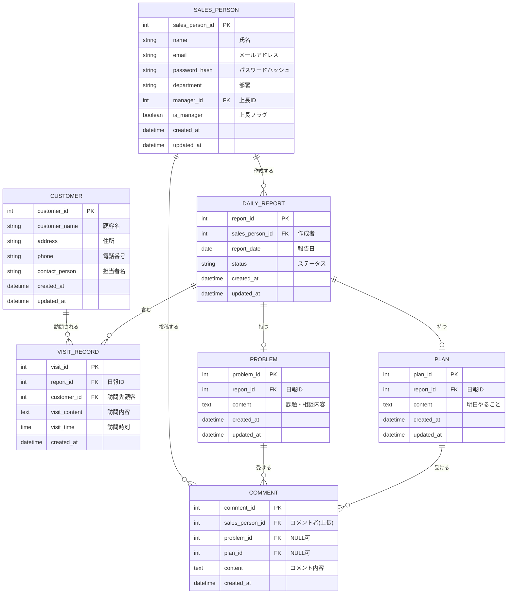
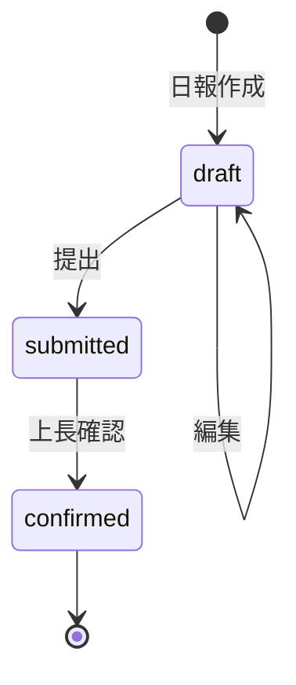

# 営業日報システム 要件定義書

## 1. システム概要

営業担当者が日々の営業活動を報告し、上長がフィードバックを行うための日報管理システム。

---

## 2. 機能要件

### 2.1 日報管理
- 営業担当者が日次で日報を作成・編集・削除できる
- 日報には報告日、作成者（営業）が紐づく
- 日報のステータス管理（下書き/提出済み/確認済み）

### 2.2 顧客訪問記録
- 1つの日報に対して複数の訪問記録を登録可能
- 訪問記録には訪問先顧客、訪問時刻、訪問内容を記載

### 2.3 Problem/Plan管理
- 日報ごとにProblem（課題・相談）を記載可能
- 日報ごとにPlan（明日やること）を記載可能

### 2.4 コメント機能
- 上長がProblem/Planに対してコメントを追加可能
- コメントは複数件登録可能

### 2.5 マスタ管理
- **顧客マスタ**: 顧客情報の登録・編集・削除
- **営業マスタ**: 営業担当者情報の登録・編集・削除（上長フラグを含む）

---

## 3. 非機能要件

### 3.1 セキュリティ
- ユーザー認証（メールアドレス/パスワード）
- 権限管理（一般営業/上長）
- 自分の日報のみ編集可能（上長は部下の日報を閲覧・コメント可能）

### 3.2 可用性
- 営業時間内（9:00-21:00）の稼働を保証

### 3.3 ユーザビリティ
- レスポンシブデザイン（PC/タブレット対応）
- 直感的な操作性

---

## 4. ユーザー種別と権限

| ユーザー種別 | 日報作成 | 日報閲覧 | 日報編集 | コメント | マスタ管理 |
|-------------|---------|---------|---------|---------|-----------|
| 一般営業 | ○（自分のみ） | ○（自分のみ） | ○（自分・未確認のみ） | × | × |
| 上長 | ○（自分のみ） | ○（部下含む） | ○（自分・未確認のみ） | ○ | ○ |

---

## 5. ER図

---

## 6. テーブル定義

### 6.1 SALES_PERSON（営業担当者マスタ）

| カラム名 | 型 | NULL | キー | 説明 |
|---------|-----|------|------|------|
| sales_person_id | INT | NO | PK | 営業担当者ID |
| name | VARCHAR(50) | NO | | 氏名 |
| email | VARCHAR(100) | NO | UQ | メールアドレス |
| password_hash | VARCHAR(255) | NO | | パスワードハッシュ |
| department | VARCHAR(50) | NO | | 部署 |
| manager_id | INT | YES | FK | 上長ID（自己参照） |
| is_manager | BOOLEAN | NO | | 上長フラグ |
| created_at | DATETIME | NO | | 作成日時 |
| updated_at | DATETIME | NO | | 更新日時 |

### 6.2 CUSTOMER（顧客マスタ）

| カラム名 | 型 | NULL | キー | 説明 |
|---------|-----|------|------|------|
| customer_id | INT | NO | PK | 顧客ID |
| customer_name | VARCHAR(100) | NO | UQ | 顧客名 |
| address | VARCHAR(200) | YES | | 住所 |
| phone | VARCHAR(20) | YES | | 電話番号 |
| contact_person | VARCHAR(50) | YES | | 担当者名 |
| created_at | DATETIME | NO | | 作成日時 |
| updated_at | DATETIME | NO | | 更新日時 |

### 6.3 DAILY_REPORT（日報）

| カラム名 | 型 | NULL | キー | 説明 |
|---------|-----|------|------|------|
| report_id | INT | NO | PK | 日報ID |
| sales_person_id | INT | NO | FK | 作成者ID |
| report_date | DATE | NO | | 報告日 |
| status | VARCHAR(20) | NO | | ステータス（draft/submitted/confirmed） |
| created_at | DATETIME | NO | | 作成日時 |
| updated_at | DATETIME | NO | | 更新日時 |

**ユニーク制約**: sales_person_id + report_date（1人1日1レポート）

### 6.4 VISIT_RECORD（訪問記録）

| カラム名 | 型 | NULL | キー | 説明 |
|---------|-----|------|------|------|
| visit_id | INT | NO | PK | 訪問ID |
| report_id | INT | NO | FK | 日報ID |
| customer_id | INT | NO | FK | 訪問先顧客ID |
| visit_content | TEXT | NO | | 訪問内容 |
| visit_time | TIME | YES | | 訪問時刻 |
| created_at | DATETIME | NO | | 作成日時 |

### 6.5 PROBLEM（課題・相談）

| カラム名 | 型 | NULL | キー | 説明 |
|---------|-----|------|------|------|
| problem_id | INT | NO | PK | 課題ID |
| report_id | INT | NO | FK, UQ | 日報ID（1日報1件） |
| content | TEXT | NO | | 課題・相談内容 |
| created_at | DATETIME | NO | | 作成日時 |
| updated_at | DATETIME | NO | | 更新日時 |

### 6.6 PLAN（明日やること）

| カラム名 | 型 | NULL | キー | 説明 |
|---------|-----|------|------|------|
| plan_id | INT | NO | PK | プランID |
| report_id | INT | NO | FK, UQ | 日報ID（1日報1件） |
| content | TEXT | NO | | 明日やること |
| created_at | DATETIME | NO | | 作成日時 |
| updated_at | DATETIME | NO | | 更新日時 |

### 6.7 COMMENT（コメント）

| カラム名 | 型 | NULL | キー | 説明 |
|---------|-----|------|------|------|
| comment_id | INT | NO | PK | コメントID |
| sales_person_id | INT | NO | FK | コメント者ID（上長） |
| problem_id | INT | YES | FK | 課題ID（排他的） |
| plan_id | INT | YES | FK | プランID（排他的） |
| content | TEXT | NO | | コメント内容 |
| created_at | DATETIME | NO | | 作成日時 |

**チェック制約**: problem_id と plan_id のいずれか一方のみがNOT NULL

---

## 7. ステータス遷移

| ステータス | 値 | 説明 |
|-----------|-----|------|
| 下書き | draft | 作成中・編集可能 |
| 提出済み | submitted | 提出済み・上長確認待ち |
| 確認済み | confirmed | 上長確認完了 |

---

## 8. 用語定義

| 用語 | 説明 |
|------|------|
| 日報 | 営業担当者が1日の活動を報告するドキュメント |
| 訪問記録 | 顧客への訪問内容の記録 |
| Problem | 現在抱えている課題や相談事項 |
| Plan | 翌日に実施予定の活動 |
| 上長 | 部下の日報を確認・コメントする権限を持つユーザー |
