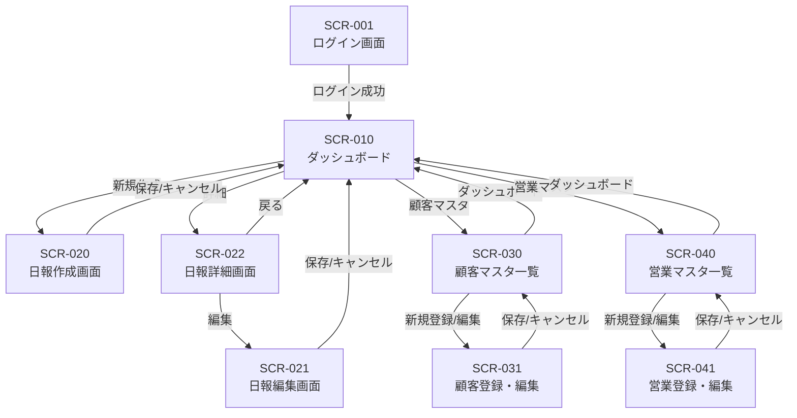

# 営業日報システム 画面定義書

## 画面一覧

| 画面ID | 画面名 | 概要 |
|--------|--------|------|
| SCR-001 | ログイン画面 | システムへのログイン |
| SCR-010 | ダッシュボード | 日報一覧・ホーム画面 |
| SCR-020 | 日報作成画面 | 新規日報の作成 |
| SCR-021 | 日報編集画面 | 既存日報の編集 |
| SCR-022 | 日報詳細画面 | 日報の閲覧・コメント |
| SCR-030 | 顧客マスタ一覧画面 | 顧客一覧の表示 |
| SCR-031 | 顧客登録・編集画面 | 顧客情報の登録・編集 |
| SCR-040 | 営業マスタ一覧画面 | 営業担当者一覧の表示 |
| SCR-041 | 営業登録・編集画面 | 営業担当者の登録・編集 |

---

## SCR-001: ログイン画面

### 概要
システムにログインするための認証画面

### 画面レイアウト
```
+------------------------------------------+
|           営業日報システム                 |
|                                          |
|   +----------------------------------+   |
|   | メールアドレス                     |   |
|   +----------------------------------+   |
|                                          |
|   +----------------------------------+   |
|   | パスワード                        |   |
|   +----------------------------------+   |
|                                          |
|   [        ログイン        ]             |
|                                          |
+------------------------------------------+
```

### 入力項目

| 項目名 | 項目ID | 種別 | 必須 | 備考 |
|--------|--------|------|------|------|
| メールアドレス | email | テキスト | ○ | メール形式チェック |
| パスワード | password | パスワード | ○ | 8文字以上 |

### ボタン・アクション

| ボタン名 | アクション | 遷移先 |
|----------|-----------|--------|
| ログイン | 認証処理実行 | SCR-010（成功時） |

### バリデーション
- メールアドレス：必須、メール形式
- パスワード：必須、8文字以上
- 認証失敗時：エラーメッセージ表示

---

## SCR-010: ダッシュボード

### 概要
日報一覧を表示するホーム画面。営業担当者は自分の日報、上長は部下の日報も閲覧可能。

### 画面レイアウト
```
+----------------------------------------------------------+
| [ロゴ]  営業日報システム        [ユーザー名▼] [ログアウト] |
+----------------------------------------------------------+
| [ダッシュボード] [顧客マスタ] [営業マスタ]                  |
+----------------------------------------------------------+
|                                                          |
|  日報一覧                           [+ 新規作成]          |
|                                                          |
|  検索: [報告日From] ～ [報告日To]  [担当者▼]  [検索]      |
|                                                          |
|  +------------------------------------------------------+|
|  | 報告日     | 担当者   | 訪問件数 | ステータス | 操作  ||
|  +------------------------------------------------------+|
|  | 2026/01/12 | 山田太郎 | 3件      | 確認済    | [詳細]||
|  | 2026/01/11 | 山田太郎 | 2件      | 未確認    | [詳細]||
|  | 2026/01/10 | 鈴木花子 | 4件      | 確認済    | [詳細]||
|  +------------------------------------------------------+|
|                                                          |
|  [<前へ] 1 / 10 [次へ>]                                   |
+----------------------------------------------------------+
```

### 表示項目

| 項目名 | 項目ID | 種別 | 備考 |
|--------|--------|------|------|
| 報告日 | report_date | 日付 | yyyy/MM/dd形式 |
| 担当者 | sales_person_name | テキスト | 営業担当者名 |
| 訪問件数 | visit_count | 数値 | 訪問記録の件数 |
| ステータス | status | テキスト | 未確認/確認済 |

### 検索条件

| 項目名 | 項目ID | 種別 | 備考 |
|--------|--------|------|------|
| 報告日From | date_from | 日付 | 検索開始日 |
| 報告日To | date_to | 日付 | 検索終了日 |
| 担当者 | sales_person_id | プルダウン | 上長のみ表示 |

### ボタン・アクション

| ボタン名 | アクション | 遷移先 |
|----------|-----------|--------|
| 新規作成 | 日報作成画面へ遷移 | SCR-020 |
| 詳細 | 日報詳細画面へ遷移 | SCR-022 |
| 検索 | 一覧を絞り込み | - |

---

## SCR-020: 日報作成画面

### 概要
新規日報を作成する画面

### 画面レイアウト
```
+----------------------------------------------------------+
| [ロゴ]  営業日報システム        [ユーザー名▼] [ログアウト] |
+----------------------------------------------------------+
| [ダッシュボード] [顧客マスタ] [営業マスタ]                  |
+----------------------------------------------------------+
|                                                          |
|  日報作成                                                 |
|                                                          |
|  報告日: [2026/01/12    ]                                |
|                                                          |
|  ■ 訪問記録                              [+ 行追加]       |
|  +------------------------------------------------------+|
|  | No | 訪問先顧客      | 訪問時刻 | 訪問内容      | 削除 ||
|  +------------------------------------------------------+|
|  | 1  | [顧客A▼]       | [10:00]  | [テキスト...]  | [×] ||
|  | 2  | [顧客B▼]       | [14:00]  | [テキスト...]  | [×] ||
|  +------------------------------------------------------+|
|                                                          |
|  ■ Problem（課題・相談）                                  |
|  +------------------------------------------------------+|
|  |                                                      ||
|  |  [テキストエリア]                                     ||
|  |                                                      ||
|  +------------------------------------------------------+|
|                                                          |
|  ■ Plan（明日やること）                                   |
|  +------------------------------------------------------+|
|  |                                                      ||
|  |  [テキストエリア]                                     ||
|  |                                                      ||
|  +------------------------------------------------------+|
|                                                          |
|  [キャンセル]                      [下書き保存] [提出]    |
+----------------------------------------------------------+
```

### 入力項目

| 項目名 | 項目ID | 種別 | 必須 | 備考 |
|--------|--------|------|------|------|
| 報告日 | report_date | 日付 | ○ | デフォルト：当日 |

**訪問記録（複数行）**

| 項目名 | 項目ID | 種別 | 必須 | 備考 |
|--------|--------|------|------|------|
| 訪問先顧客 | customer_id | プルダウン | ○ | 顧客マスタから選択 |
| 訪問時刻 | visit_time | 時刻 | - | HH:mm形式 |
| 訪問内容 | visit_content | テキストエリア | ○ | 最大1000文字 |

**Problem/Plan**

| 項目名 | 項目ID | 種別 | 必須 | 備考 |
|--------|--------|------|------|------|
| Problem | problem_content | テキストエリア | - | 最大2000文字 |
| Plan | plan_content | テキストエリア | - | 最大2000文字 |

### ボタン・アクション

| ボタン名 | アクション | 遷移先 |
|----------|-----------|--------|
| 行追加 | 訪問記録行を追加 | - |
| × | 該当行を削除 | - |
| キャンセル | 入力破棄・確認ダイアログ表示 | SCR-010 |
| 下書き保存 | 下書きとして保存 | SCR-010 |
| 提出 | 日報を提出 | SCR-010 |

### バリデーション
- 報告日：必須、未来日不可
- 訪問記録：最低1件必須（提出時）
- 訪問先顧客：必須
- 訪問内容：必須、最大1000文字

---

## SCR-021: 日報編集画面

### 概要
既存日報を編集する画面（SCR-020と同様のレイアウト）

### 補足
- 画面レイアウト・入力項目はSCR-020と同様
- 既存データを初期表示
- 提出済み日報は編集不可（上長確認前のみ編集可能）

---

## SCR-022: 日報詳細画面

### 概要
日報の詳細を閲覧し、上長がコメントを追加できる画面

### 画面レイアウト
```
+----------------------------------------------------------+
| [ロゴ]  営業日報システム        [ユーザー名▼] [ログアウト] |
+----------------------------------------------------------+
| [ダッシュボード] [顧客マスタ] [営業マスタ]                  |
+----------------------------------------------------------+
|                                                          |
|  日報詳細                                    [編集] [戻る]|
|                                                          |
|  報告日: 2026/01/12        担当者: 山田太郎               |
|  ステータス: 未確認                                       |
|                                                          |
|  ■ 訪問記録                                              |
|  +------------------------------------------------------+|
|  | No | 訪問先顧客   | 訪問時刻 | 訪問内容               ||
|  +------------------------------------------------------+|
|  | 1  | 株式会社ABC  | 10:00   | 新製品の提案を実施...    ||
|  | 2  | 株式会社XYZ  | 14:00   | 契約更新の打ち合わせ...  ||
|  +------------------------------------------------------+|
|                                                          |
|  ■ Problem（課題・相談）                                  |
|  +------------------------------------------------------+|
|  | 顧客Aの予算が厳しく、値引き交渉が必要。               ||
|  | どの程度まで対応可能か相談したい。                    ||
|  +------------------------------------------------------+|
|  | 💬 コメント                                           ||
|  | +--------------------------------------------------+ ||
|  | | 田中部長 (2026/01/12 18:30)                      | ||
|  | | 10%までなら対応可能です。詳細は明日話しましょう。 | ||
|  | +--------------------------------------------------+ ||
|  | [コメント入力欄                    ] [コメント追加]  ||
|  +------------------------------------------------------+|
|                                                          |
|  ■ Plan（明日やること）                                   |
|  +------------------------------------------------------+|
|  | ・顧客Aへ再提案                                       ||
|  | ・顧客Bへ電話フォロー                                 ||
|  +------------------------------------------------------+|
|  | 💬 コメント                                           ||
|  | （コメントなし）                                      ||
|  | [コメント入力欄                    ] [コメント追加]  ||
|  +------------------------------------------------------+|
|                                                          |
|  [確認済みにする]  ※上長のみ表示                         |
+----------------------------------------------------------+
```

### 表示項目

| 項目名 | 項目ID | 種別 | 備考 |
|--------|--------|------|------|
| 報告日 | report_date | 日付 | yyyy/MM/dd形式 |
| 担当者 | sales_person_name | テキスト | - |
| ステータス | status | テキスト | 未確認/確認済 |
| 訪問記録一覧 | visits | 一覧 | - |
| Problem | problem_content | テキスト | - |
| Plan | plan_content | テキスト | - |
| コメント一覧 | comments | 一覧 | 投稿者名・日時・内容 |

### 入力項目（上長のみ）

| 項目名 | 項目ID | 種別 | 必須 | 備考 |
|--------|--------|------|------|------|
| コメント（Problem用） | problem_comment | テキスト | - | 最大500文字 |
| コメント（Plan用） | plan_comment | テキスト | - | 最大500文字 |

### ボタン・アクション

| ボタン名 | アクション | 遷移先 | 表示条件 |
|----------|-----------|--------|----------|
| 編集 | 編集画面へ遷移 | SCR-021 | 本人かつ未確認 |
| 戻る | 一覧へ戻る | SCR-010 | - |
| コメント追加 | コメントを保存 | - | 上長のみ |
| 確認済みにする | ステータス更新 | - | 上長のみ |

---

## SCR-030: 顧客マスタ一覧画面

### 概要
顧客情報の一覧を表示・管理する画面

### 画面レイアウト
```
+----------------------------------------------------------+
| [ロゴ]  営業日報システム        [ユーザー名▼] [ログアウト] |
+----------------------------------------------------------+
| [ダッシュボード] [顧客マスタ] [営業マスタ]                  |
+----------------------------------------------------------+
|                                                          |
|  顧客マスタ                              [+ 新規登録]     |
|                                                          |
|  検索: [顧客名          ]  [検索]                         |
|                                                          |
|  +------------------------------------------------------+|
|  | 顧客ID | 顧客名       | 担当者名   | 電話番号    | 操作||
|  +------------------------------------------------------+|
|  | C001   | 株式会社ABC  | 佐藤様     | 03-1234-... |[編集]|
|  | C002   | 株式会社XYZ  | 高橋様     | 03-5678-... |[編集]|
|  +------------------------------------------------------+|
|                                                          |
|  [<前へ] 1 / 5 [次へ>]                                    |
+----------------------------------------------------------+
```

### 表示項目

| 項目名 | 項目ID | 種別 | 備考 |
|--------|--------|------|------|
| 顧客ID | customer_id | テキスト | - |
| 顧客名 | customer_name | テキスト | - |
| 担当者名 | contact_person | テキスト | 顧客側担当者 |
| 電話番号 | phone | テキスト | - |

### ボタン・アクション

| ボタン名 | アクション | 遷移先 |
|----------|-----------|--------|
| 新規登録 | 登録画面へ遷移 | SCR-031 |
| 編集 | 編集画面へ遷移 | SCR-031 |
| 検索 | 一覧を絞り込み | - |

---

## SCR-031: 顧客登録・編集画面

### 概要
顧客情報を登録・編集する画面

### 画面レイアウト
```
+----------------------------------------------------------+
| [ロゴ]  営業日報システム        [ユーザー名▼] [ログアウト] |
+----------------------------------------------------------+
| [ダッシュボード] [顧客マスタ] [営業マスタ]                  |
+----------------------------------------------------------+
|                                                          |
|  顧客登録                                                 |
|                                                          |
|  顧客名 *                                                 |
|  +------------------------------------------------------+|
|  | 株式会社ABC                                           ||
|  +------------------------------------------------------+|
|                                                          |
|  住所                                                    |
|  +------------------------------------------------------+|
|  | 東京都千代田区...                                     ||
|  +------------------------------------------------------+|
|                                                          |
|  電話番号                                                 |
|  +------------------------------------------------------+|
|  | 03-1234-5678                                         ||
|  +------------------------------------------------------+|
|                                                          |
|  担当者名                                                 |
|  +------------------------------------------------------+|
|  | 佐藤様                                                ||
|  +------------------------------------------------------+|
|                                                          |
|  [キャンセル]                                   [保存]    |
+----------------------------------------------------------+
```

### 入力項目

| 項目名 | 項目ID | 種別 | 必須 | 備考 |
|--------|--------|------|------|------|
| 顧客名 | customer_name | テキスト | ○ | 最大100文字 |
| 住所 | address | テキスト | - | 最大200文字 |
| 電話番号 | phone | テキスト | - | 電話番号形式 |
| 担当者名 | contact_person | テキスト | - | 最大50文字 |

### ボタン・アクション

| ボタン名 | アクション | 遷移先 |
|----------|-----------|--------|
| キャンセル | 入力破棄 | SCR-030 |
| 保存 | データ保存 | SCR-030 |

### バリデーション
- 顧客名：必須、最大100文字、重複不可
- 電話番号：電話番号形式（任意）

---

## SCR-040: 営業マスタ一覧画面

### 概要
営業担当者の一覧を表示・管理する画面

### 画面レイアウト
```
+----------------------------------------------------------+
| [ロゴ]  営業日報システム        [ユーザー名▼] [ログアウト] |
+----------------------------------------------------------+
| [ダッシュボード] [顧客マスタ] [営業マスタ]                  |
+----------------------------------------------------------+
|                                                          |
|  営業マスタ                              [+ 新規登録]     |
|                                                          |
|  検索: [氏名            ]  [部署▼]  [検索]                |
|                                                          |
|  +------------------------------------------------------+|
|  | 社員ID | 氏名     | 部署   | 上長     | 権限   | 操作 ||
|  +------------------------------------------------------+|
|  | E001   | 山田太郎 | 営業1課| 田中部長 | 一般   |[編集]||
|  | E002   | 鈴木花子 | 営業1課| 田中部長 | 一般   |[編集]||
|  | E003   | 田中一郎 | 営業1課| -        | 上長   |[編集]||
|  +------------------------------------------------------+|
|                                                          |
|  [<前へ] 1 / 3 [次へ>]                                    |
+----------------------------------------------------------+
```

### 表示項目

| 項目名 | 項目ID | 種別 | 備考 |
|--------|--------|------|------|
| 社員ID | sales_person_id | テキスト | - |
| 氏名 | name | テキスト | - |
| 部署 | department | テキスト | - |
| 上長 | manager_name | テキスト | 上長の氏名 |
| 権限 | is_manager | テキスト | 一般/上長 |

### ボタン・アクション

| ボタン名 | アクション | 遷移先 |
|----------|-----------|--------|
| 新規登録 | 登録画面へ遷移 | SCR-041 |
| 編集 | 編集画面へ遷移 | SCR-041 |

---

## SCR-041: 営業登録・編集画面

### 概要
営業担当者を登録・編集する画面

### 画面レイアウト
```
+----------------------------------------------------------+
| [ロゴ]  営業日報システム        [ユーザー名▼] [ログアウト] |
+----------------------------------------------------------+
| [ダッシュボード] [顧客マスタ] [営業マスタ]                  |
+----------------------------------------------------------+
|                                                          |
|  営業登録                                                 |
|                                                          |
|  氏名 *                                                   |
|  +------------------------------------------------------+|
|  | 山田太郎                                              ||
|  +------------------------------------------------------+|
|                                                          |
|  メールアドレス *                                         |
|  +------------------------------------------------------+|
|  | yamada@example.com                                   ||
|  +------------------------------------------------------+|
|                                                          |
|  部署 *                                                   |
|  +------------------------------------------------------+|
|  | 営業1課                                       ▼      ||
|  +------------------------------------------------------+|
|                                                          |
|  上長                                                     |
|  +------------------------------------------------------+|
|  | 田中一郎                                      ▼      ||
|  +------------------------------------------------------+|
|                                                          |
|  □ 上長権限を付与する                                    |
|                                                          |
|  [キャンセル]                                   [保存]    |
+----------------------------------------------------------+
```

### 入力項目

| 項目名 | 項目ID | 種別 | 必須 | 備考 |
|--------|--------|------|------|------|
| 氏名 | name | テキスト | ○ | 最大50文字 |
| メールアドレス | email | テキスト | ○ | メール形式、重複不可 |
| 部署 | department | プルダウン | ○ | 部署一覧から選択 |
| 上長 | manager_id | プルダウン | - | 上長一覧から選択 |
| 上長権限 | is_manager | チェックボックス | - | チェック時：上長 |

### ボタン・アクション

| ボタン名 | アクション | 遷移先 |
|----------|-----------|--------|
| キャンセル | 入力破棄 | SCR-040 |
| 保存 | データ保存 | SCR-040 |

### バリデーション
- 氏名：必須、最大50文字
- メールアドレス：必須、メール形式、重複不可
- 部署：必須

---

## 画面遷移図



---

## 共通仕様

### ヘッダー
- ロゴ：クリックでダッシュボードへ遷移
- ユーザー名：ログイン中のユーザー名を表示
- ログアウト：ログアウト処理後、ログイン画面へ遷移

### ナビゲーション
- ダッシュボード：SCR-010へ遷移
- 顧客マスタ：SCR-030へ遷移
- 営業マスタ：SCR-040へ遷移（上長のみ表示）

### メッセージ表示
- 成功メッセージ：緑色バー（画面上部）
- エラーメッセージ：赤色バー（画面上部）
- 確認ダイアログ：削除・キャンセル時に表示

### ページネーション
- 1ページあたり20件表示
- 前へ/次へボタンで遷移
- 現在ページ/総ページ数を表示
